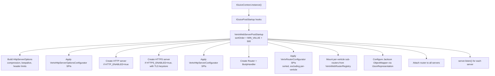
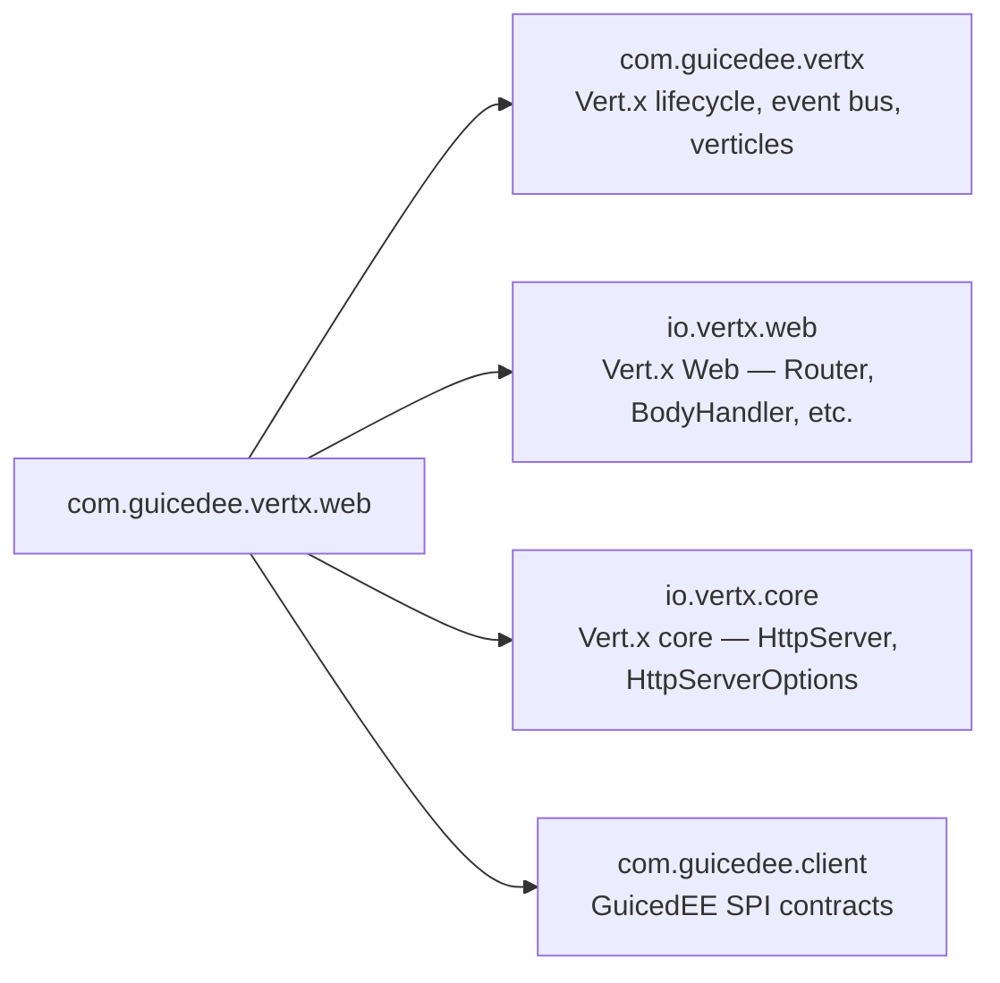

# GuicedEE Vert.x Web

[](https://github.com/GuicedEE/GuicedVertxWeb/actions/workflows/build.yml)
[](https://central.sonatype.com/artifact/com.guicedee/web)
[](https://www.apache.org/licenses/LICENSE-2.0)


Reactive **HTTP/HTTPS server bootstrap** for [GuicedEE](https://github.com/GuicedEE) applications using **Vert.x 5**.
Provides the `Router`, `HttpServer`, and `BodyHandler` plumbing that higher-level modules ([rest](../rest), [websockets](../websockets), etc.) build on top of. Configuration is environment-driven; extension is SPI-driven.

Built on [Vert.x Web](https://vertx.io/docs/vertx-web/java/) · [GuicedEE](https://github.com/GuicedEE) · JPMS module `com.guicedee.vertx.web` · Java 25+

## 📦 Installation

```xml
<dependency>
  <groupId>com.guicedee</groupId>
  <artifactId>web</artifactId>
</dependency>
```

<details>
<summary>Gradle (Kotlin DSL)</summary>

```kotlin
implementation("com.guicedee:web:2.0.1")
```
</details>

## ✨ Features

- **Auto-start HTTP/HTTPS servers** — `VertxWebServerPostStartup` runs as an `IGuicePostStartup` hook and creates servers from environment config
- **Three SPI extension points** — `VertxHttpServerOptionsConfigurator`, `VertxHttpServerConfigurator`, `VertxRouterConfigurator`
- **TLS/HTTPS** — JKS and PKCS#12 keystores auto-detected by file extension
- **Body handling** — `BodyHandler` pre-configured with file uploads, form merging, and configurable size limits
- **Per-verticle sub-routers** — `VertxWebVerticleStartup` creates isolated routers for `@Verticle`-annotated packages
- **Jackson integration** — `DatabindCodec` mapper configured via `IJsonRepresentation` at startup
- **Environment-driven** — HTTP/HTTPS ports, TLS, body limits all controlled via system properties or environment variables

## 🚀 Quick Start

Bootstrap GuicedEE — the web server starts automatically via the post-startup hook:

```java
IGuiceContext.registerModuleForScanning.add("my.app");
IGuiceContext.instance();
// HTTP server is now listening on port 8080 (default)
```

Add routes by implementing `VertxRouterConfigurator`:

```java
public class MyRoutes implements VertxRouterConfigurator<MyRoutes> {

    @Override
    public Router builder(Router router) {
        router.get("/health").handler(ctx ->
            ctx.response().end("OK"));
        return router;
    }

    @Override
    public Integer sortOrder() {
        return 500;  // higher = later
    }
}
```

Register via JPMS:

```java
module my.app {
    requires com.guicedee.vertx.web;

    provides com.guicedee.vertx.web.spi.VertxRouterConfigurator
        with my.app.MyRoutes;
}
```

## 📐 Startup Flow



## 🔌 SPI Extension Points

All SPIs are discovered via `ServiceLoader`. Register implementations with JPMS `provides...with` or `META-INF/services`.

### `VertxHttpServerOptionsConfigurator`

Customize `HttpServerOptions` **before** servers are created — ports, TLS, compression, buffer sizes:

```java
public class MyServerOptions implements VertxHttpServerOptionsConfigurator {
    @Override
    public HttpServerOptions builder(HttpServerOptions options) {
        options.setIdleTimeout(60);
        return options;
    }
}
```

### `VertxHttpServerConfigurator`

Configure the `HttpServer` instance **after** creation — WebSocket upgrade handlers, connection hooks:

```java
public class MyServerConfig implements VertxHttpServerConfigurator {
    @Override
    public HttpServer builder(HttpServer server) {
        server.connectionHandler(conn ->
            log.info("New connection from {}", conn.remoteAddress()));
        return server;
    }
}
```

### `VertxRouterConfigurator`

Add routes, middleware, and handlers to the `Router`. Implements `IDefaultService` so `sortOrder()` controls execution order:

```java
public class StaticFiles implements VertxRouterConfigurator<StaticFiles> {
    @Override
    public Router builder(Router router) {
        router.route("/static/*").handler(StaticHandler.create("webroot"));
        return router;
    }

    @Override
    public Integer sortOrder() {
        return 900;  // run after REST routes
    }
}
```

## ⚙️ Configuration

All configuration is driven by system properties or environment variables:

| Variable | Default | Purpose |
|---|---|---|
| `HTTP_ENABLED` | `true` | Enable HTTP server |
| `HTTP_PORT` | `8080` | HTTP listen port |
| `HTTPS_ENABLED` | `false` | Enable HTTPS server |
| `HTTPS_PORT` | `443` | HTTPS listen port |
| `HTTPS_KEYSTORE` | — | Path to JKS or PKCS#12 keystore |
| `HTTPS_KEYSTORE_PASSWORD` | — | Keystore password (`changeit` default for JKS) |
| `VERTX_MAX_BODY_SIZE` | `524288000` (500 MB) | Maximum request body size in bytes |

### HTTPS / TLS

Keystore format is auto-detected by file extension:

| Extension | Format |
|---|---|
| `.jks` | JKS |
| `.pfx`, `.p12`, `.p8` | PKCS#12 |

```bash
# Generate a self-signed JKS keystore for development
keytool -genkey -alias dev -keyalg RSA -keysize 2048 \
  -validity 365 -keystore keystore.jks -storepass changeit
```

### Default server options

`VertxWebServerPostStartup` applies these defaults before any SPI configurator runs:

| Option | Value |
|---|---|
| Compression | enabled, level 9 |
| TCP keep-alive | `true` |
| Max header size | 65 536 bytes |
| Max chunk size | 65 536 bytes |
| Max form attribute size | 65 536 bytes |
| Max form fields | unlimited (`-1`) |
| Max initial line length | 65 536 bytes |

### Body handler defaults

A `BodyHandler` is installed on all routes with:

| Setting | Value |
|---|---|
| Uploads directory | `uploads` |
| Delete uploaded files on end | `true` |
| Handle file uploads | `true` |
| Merge form attributes | `true` |
| Body limit | `VERTX_MAX_BODY_SIZE` (default 500 MB) |

## 🔀 Per-Verticle Sub-Routers

When a package is annotated with `@Verticle`, `VertxWebVerticleStartup` creates a dedicated `Router` for that package's `VertxRouterConfigurator` implementations. These sub-routers are mounted onto the main router automatically.

This means route configurators in `@Verticle` packages are **excluded** from the global router and instead run inside their verticle's isolated context.

```java
@Verticle(workerPoolName = "api-pool", workerPoolSize = 8)
package com.example.api;
```

Any `VertxRouterConfigurator` in `com.example.api` (or sub-packages) will be applied to a dedicated sub-router mounted by `VertxWebVerticleStartup`.

## 🗺️ Module Graph



## 🧩 JPMS

Module name: **`com.guicedee.vertx.web`**

The module:
- **exports** `com.guicedee.vertx.web.spi`
- **provides** `IGuicePostStartup` with `VertxWebServerPostStartup`
- **uses** `VertxRouterConfigurator`, `VertxHttpServerConfigurator`, `VertxHttpServerOptionsConfigurator`

## 🏗️ Key Classes

| Class | Role |
|---|---|
| `VertxWebServerPostStartup` | `IGuicePostStartup` — builds servers, router, and starts listening |
| `VertxWebVerticleStartup` | `VerticleStartup` — creates per-verticle sub-routers |
| `VertxWebRouterRegistry` | Thread-safe registry for sub-routers contributed by verticles |
| `VertxRouterConfigurator` | SPI — add routes and handlers to the `Router` |
| `VertxHttpServerConfigurator` | SPI — customize `HttpServer` instances |
| `VertxHttpServerOptionsConfigurator` | SPI — customize `HttpServerOptions` before server creation |

## 🤝 Contributing

Issues and pull requests are welcome — please add tests for new SPI implementations or server configurations.

## 📄 License

[Apache 2.0](https://www.apache.org/licenses/LICENSE-2.0)
