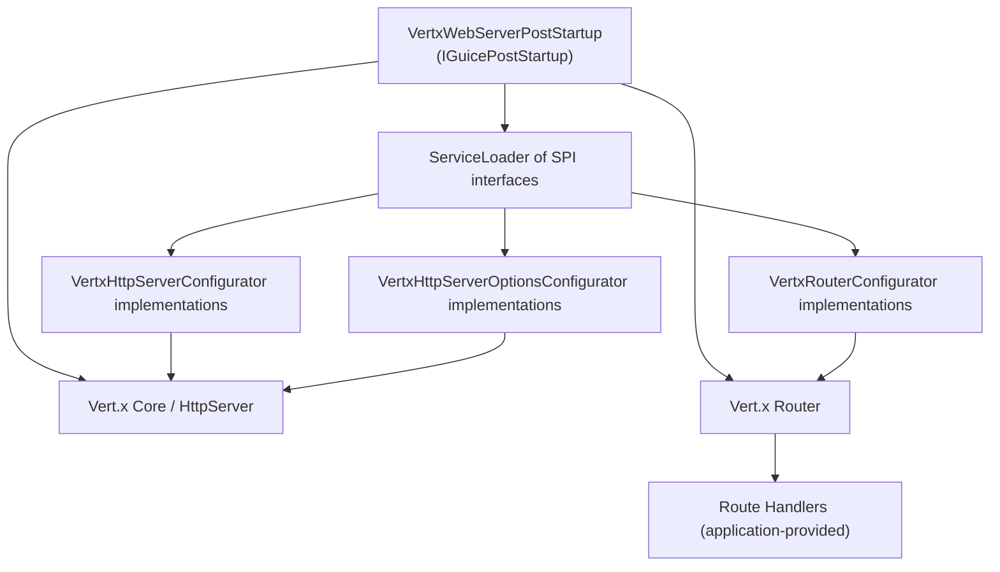

# C4 Level 3 — Vert.x Web Components

Component breakdown derived from `module-info.java` SPIs and expected startup path.

Observations and assumptions:
- JPMS `uses` entries indicate configurators are discovered dynamically; implementers live in host modules.
- The module exports only `com.guicedee.vertx.web.spi`, keeping server setup classes internal.
- `VertxWebServerPostStartup` reads `HTTP_ENABLED`/`HTTP_PORT` and `HTTPS_ENABLED`/`HTTPS_PORT` plus `HTTPS_KEYSTORE`/`HTTPS_KEYSTORE_PASSWORD` to create servers and configure TLS.
- A default `BodyHandler` is registered (uploads → `uploads/`, deleted on request end); override via router configurators as needed.
