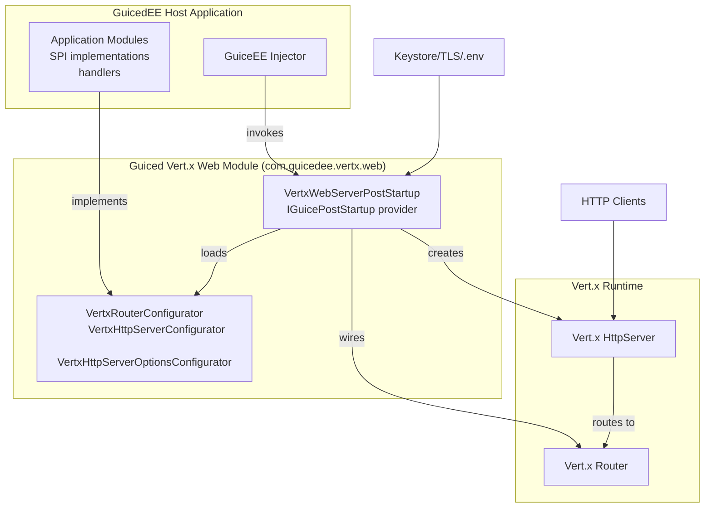

# C4 Level 2 — Containers

Container responsibilities inferred from `module-info.java` (SPI usage/provision) and Maven dependencies.

Notes:
- JPMS exports `com.guicedee.vertx.web.spi` for configurator types.
- Startup provider is registered through `provides IGuicePostStartup with VertxWebServerPostStartup`.
