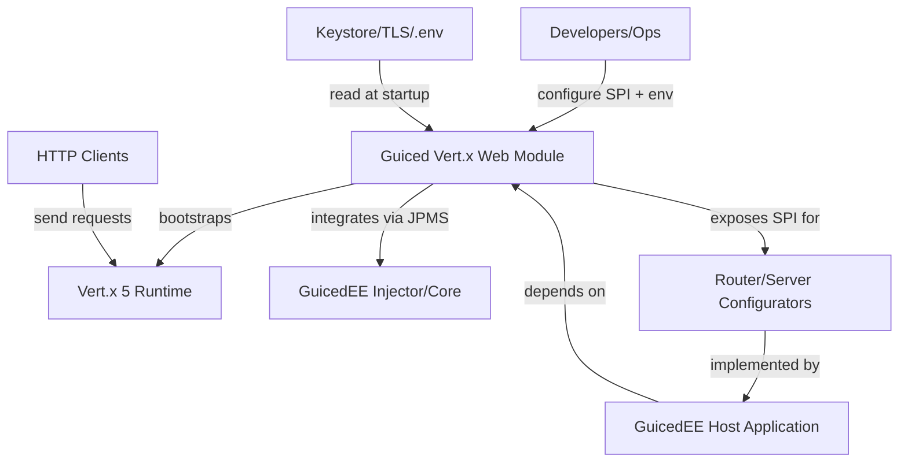

# C4 Level 1 — System Context

`guiced-vertx-web` exposes a JPMS module (`com.guicedee.vertx.web`) that boots a Vert.x Web server and router via GuicedEE SPIs. The context reflects what is visible from `module-info.java` and `pom.xml`.

Trust boundaries: HTTP clients interact over the network with Vert.x; configurators are application-provided; secrets flow in through keystore/env during server bootstrap.
