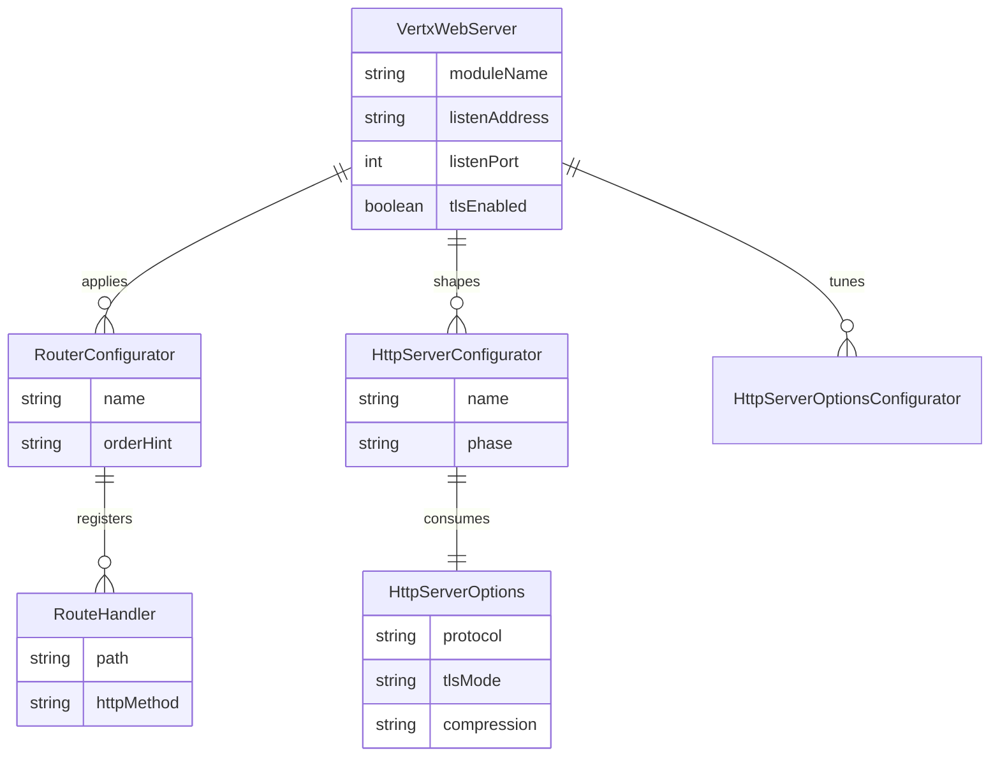

# ERD — Core Configuration Relationships

Conceptual relationships for Vert.x Web server configuration objects implied by the JPMS SPI contracts. No persistent datastore is defined in the repository; this ERD captures configuration ownership for traceability.

Assumptions are placeholders until concrete configurator implementations and configuration schemas are present in the codebase.
