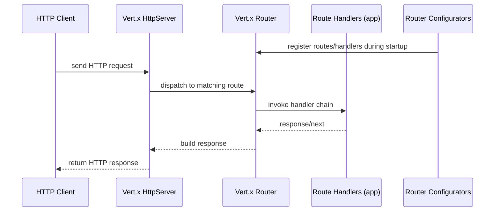

# Sequence — HTTP Request Handling

Request/response path through the Vert.x Web server and application-provided handlers.

```mermaid
sequenceDiagram
    participant Client as HTTP Client
    participant HttpServer as Vert.x HttpServer
    participant Router as Vert.x Router
    participant Handler as Route Handlers (app)
    participant Config as Router Configurators

    Config->>Router: register routes/handlers during startup
    Client->>HttpServer: send HTTP request
    HttpServer->>Router: dispatch to matching route
    Router->>Handler: invoke handler chain
    Handler-->>Router: response/next
    Router-->>HttpServer: build response
    HttpServer-->>Client: return HTTP response
```
