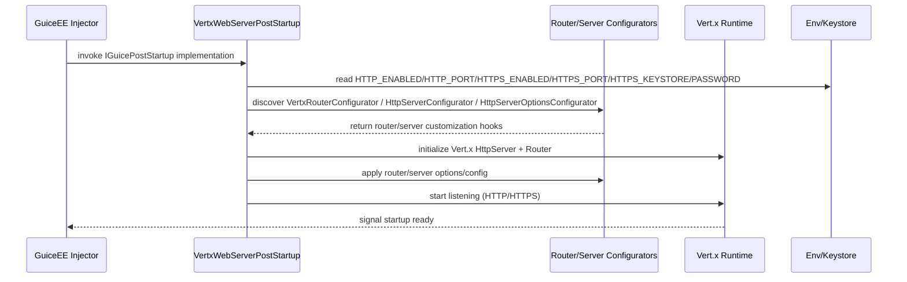

# Sequence — Guice Startup → Vert.x Web

Startup flow inferred from JPMS services; clarify concrete configurator implementations in GUIDES/IMPLEMENTATION once code is present.

```mermaid
sequenceDiagram
    participant Guice as GuiceEE Injector
    participant Startup as VertxWebServerPostStartup
    participant SPI as Router/Server Configurators
    participant Vertx as Vert.x Runtime
    participant Secrets as Env/Keystore

    Guice->>Startup: invoke IGuicePostStartup implementation
    Startup->>Secrets: read HTTP_ENABLED/HTTP_PORT/HTTPS_ENABLED/HTTPS_PORT/HTTPS_KEYSTORE/PASSWORD
    Startup->>SPI: discover VertxRouterConfigurator / HttpServerConfigurator / HttpServerOptionsConfigurator
    SPI-->>Startup: return router/server customization hooks
    Startup->>Vertx: initialize Vert.x HttpServer + Router
    Startup->>SPI: apply router/server options/config
    Startup->>Vertx: start listening (HTTP/HTTPS)
    Vertx-->>Guice: signal startup ready
```
